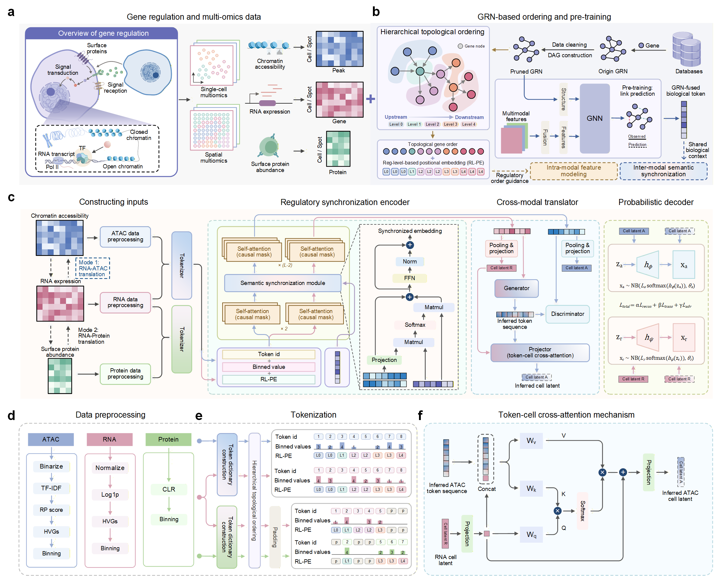

# ReguSync: GRN-Guided Single-Cell Multimodal Language Model

**ReguSync** is a GRN-guided single-cell multimodal language model for cross-modal translation in single-cell and spatial multi-omics data. This repository is the official implementation of our paper, “ReguSync: Synchronizing Multi-Omics Semantics via a GRN-Driven Single-Cell Language Model for Cross-Modal Translation”. It includes model code, preprocessing workflows, and usage examples for single-cell and spatial multi-omics translation tasks.

## Overview
Single-cell multi-omics profiling provides powerful insights into cellular heterogeneity, but it is often costly and technically noisy. ReguSync addresses these challenges by leveraging gene regulatory networks (GRNs) to guide both intra-modal feature modeling and cross-modal semantic synchronization, thereby achieving accurate and biologically informed cross-modal translation.




## Getting Started

### Key Requirements
+ python >= 3.9.19
+ pytorch >= 2.2.0
+ numpy >= 1.24.3
+ scipy >= 1.13.1
+ pandas >= 2.3.3
+ scikit-learn >= 1.4.0
+ flash-attn >= 2.5.2
+ scanpy >= 1.9.8
+ episcanpy >= 0.4.0
+ torchtext == 0.17.0

### Hardware Note
ReguSync requires GPU acceleration for model training and inference. The original experiments were conducted on an NVIDIA RTX 4090 GPU with CUDA 12.5.

### Installation
We recommend using conda to create the running environment for ReguSync. The model dependencies and environment configuration are provided in environment.yml.

```bash
git clone https://github.com/your-username/ReguSync.git
cd ReguSync

conda env create -f environment.yml
conda activate regusync
```

### Quick Start
```python
# Example usage
from regusync import ReguSync

model = ReguSync()
model.train(data)
predicted_profiles = model.translate(query_data)
```

## Datasets
The sample dataset used in this repository is available from Google Drive:

[Download sample dataset](https://drive.google.com/drive/folders/1BOGt_-5vxkRv5HdzHLPlAnnEJBBMrlp1?usp=sharing)

After downloading, please copy the dataset files into the `Dataset` folder under the root directory of this repository.

The expected directory structure is:

```text
ReguSync/
├── Dataset/
│   ├── Paired_RNA_train.h5ad
│   ├── Paired_RNA_test.h5ad
│   ├── Paired_ATAC_train.h5ad
│   └── Paired_ATAC_test.h5ad
├── README.md
└── ...
```

## License
This project is released under the MIT License.
