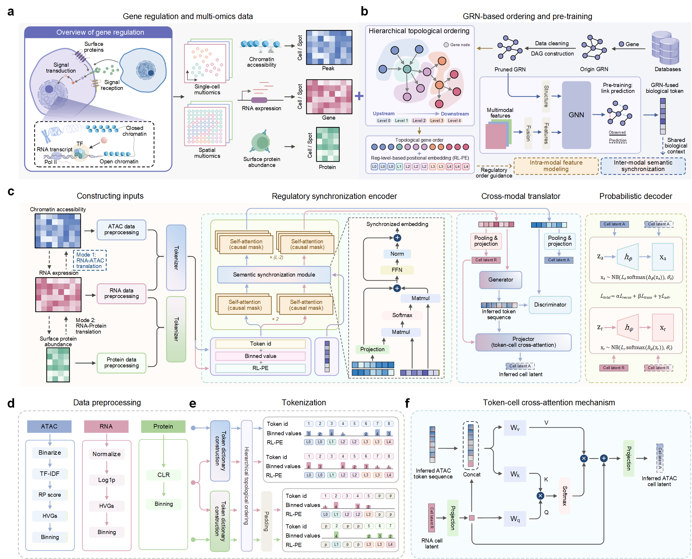

# ReguSync🔄: GRN-Guided Single-Cell Multimodal Language Model

## Overview
**ReguSync** is a GRN-guided single-cell multimodal language model for cross-modal translation in single-cell and spatial multi-omics data. This repository is the official implementation of our paper, “ReguSync: Synchronizing Multi-Omics Semantics via a GRN-Driven Single-Cell Language Model for Cross-Modal Translation”. It includes model code, preprocessing workflows, and usage examples for single-cell and spatial multi-omics translation tasks.

Single-cell multi-omics profiling provides powerful insights into cellular heterogeneity, but it is often costly and technically noisy. ReguSync addresses these challenges by leveraging gene regulatory networks to guide both intra-modal feature modeling and cross-modal semantic synchronization, thereby achieving accurate and biologically informed cross-modal translation.

## Workflow



## Getting Started

### Key Requirements
```text
python >= 3.9.19
pytorch >= 2.2.0
numpy >= 1.24.3
scipy >= 1.13.1
pandas >= 2.3.3
scikit-learn >= 1.4.0
flash-attn >= 2.5.2
scanpy >= 1.9.8
episcanpy >= 0.4.0
torchtext == 0.17.0
```

### Hardware Note
ReguSync requires GPU acceleration for model training and inference. The original experiments were conducted on an NVIDIA RTX 4090 GPU with CUDA 12.5.

### Installation
We recommend using conda to create the running environment for ReguSync. The model dependencies and environment configuration are provided in environment.yml.

```bash
git clone https://github.com/your-username/ReguSync.git
cd ReguSync

conda env create -f environment.yml
conda activate regusync
```

## Quick Start

ReguSync can be run through the provided `run.py` script. The script calls `run_ReguSync()` and specifies the input paired multi-omics data, model settings, and training configuration.

```python
from regusync_main import run_ReguSync

run_ReguSync(
    n_epochs=200,
    train_batch_size=128,
    test_batch_size=256,
    dataset="RNA_ATAC_translation",
    modal_a_train="./Dataset/Paired_RNA_train.h5ad",
    modal_b_train="./Dataset/Paired_ATAC_train.h5ad",
    modal_a_test="./Dataset/Paired_RNA_test.h5ad",
    modal_b_test="./Dataset/Paired_ATAC_test.h5ad",
    species="human",
    d_model=128,
    n_hvg=1000,
    ram_usage_optimization=False,
    spatial=False,
)
```

Before running the script, please make sure that the required input files have been placed under the expected directories, including the paired training and test datasets in `Dataset/`, the required resource files in `Resources/`, and the precomputed cache files in `Cache/`.

To run the example, execute:

```bash
python run.py
```

The output files, logs, and model-generated results will be saved under the `Results/` directory.

## Tutorial

The ReguSync tutorial and extended documentation are available on [Read the Docs](https://regusync-tutorial.readthedocs.io/en/latest/). The tutorial source is hosted in the [ReguSync Tutorial repository](https://github.com/ChrisOliver2345/ReguSync-tutorial). The tutorial will continue to expand with new examples and workflows.

## Project Structure

```text
ReguSync/
├── Dataset/          # Input datasets
├── Resources/        # Reference gene score files
├── Gene_order/       # GRN-based gene ordering files
├── Cache/            # Precomputed intermediate data
├── Results/          # Model outputs and logs
├── Figures/          # Documentation figures
├── regusync_main.py  # Main ReguSync pipeline
├── run.py            # Example entry point
├── model.py          # Model architecture
├── train.py          # Training and evaluation
├── preprocess.py     # Data preprocessing
└── environment.yml   # Conda environment
```


## Resources
The `Resources/` directory stores auxiliary resource files required for running ReguSync.

The following reference gene score files may be used for computing RP scores from ATAC peak matrices:

```text
GRCh38.refgenes.genescore.adjusted.csv
GRCh38.refgenes.genescore.simple.csv
GRCm38.refgenes.genescore.adjusted.csv
GRCm38.refgenes.genescore.simple.csv
```

These files have been uploaded to Google Drive and can be accessed at:

```text
https://drive.google.com/drive/folders/1kt8DroYUTSJZWuzoQ0YRnehYXj7qXkNZ?usp=sharing
```

After downloading, please place these files under the following directory:

```text
ReguSync/
└── Resources/
    ├── GRCh38.refgenes.genescore.adjusted.csv
    ├── GRCh38.refgenes.genescore.simple.csv
    ├── GRCm38.refgenes.genescore.adjusted.csv
    └── GRCm38.refgenes.genescore.simple.csv
```

The precomputed RP score matrix used for the RNA-ATAC translation example is also available from Google Drive:

https://drive.google.com/drive/folders/1BOGt_-5vxkRv5HdzHLPlAnnEJBBMrlp1?usp=sharing

After downloading, please place the precomputed RP score matrix under the following directory:

```text
ReguSync/
└── Cache/
    └── RNA_ATAC_translation/
```


## Datasets
The sample dataset used in this repository is available from Google Drive:

[Download sample dataset](https://drive.google.com/drive/folders/1BOGt_-5vxkRv5HdzHLPlAnnEJBBMrlp1?usp=sharing)

After downloading, please copy the dataset files into the `Dataset` folder under the root directory of this repository.

The expected directory structure is:

```text
ReguSync/
├── Dataset/
│   ├── Paired_RNA_train.h5ad
│   ├── Paired_RNA_test.h5ad
│   ├── Paired_ATAC_train.h5ad
│   └── Paired_ATAC_test.h5ad
├── README.md
└── ...
```

## License
This project is released under the MIT License.
